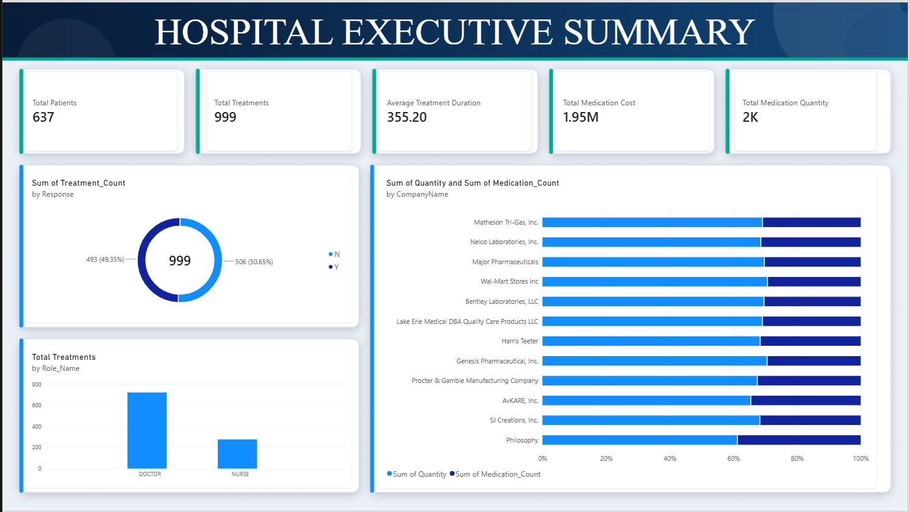
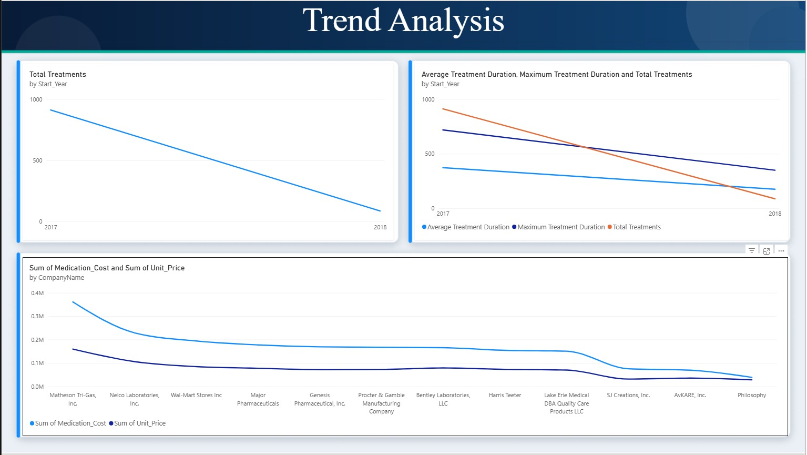
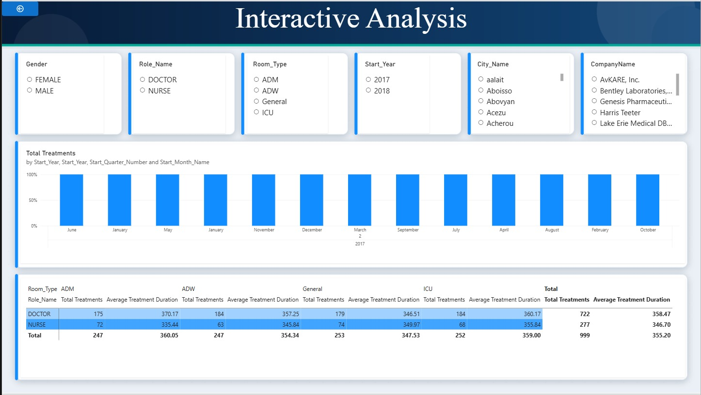

# Hospital Data Warehousing and Business Intelligence Project

## Overview
This repository contains the documentation and resources for the IT3101 - Data Warehousing and Business Intelligence assignment. The project focuses on building a data warehouse and developing a Business Intelligence (BI) dashboard for a hospital management system to assist in performance evaluation and executive decision-making.

## Project Structure
The project is divided into several key tasks:

1. **Background & Objective**
   The goal is to analyze hospital data, manage stock lifecycles, evaluate revenue streams, and optimize operations. It aims to identify trends, workload imbalances, and performance metrics.

2. **Data Staging Area**
   A dedicated staging area was used to extract, clean, and consolidate data from multiple operational systems before loading it into the data warehouse.

3. **Data Warehouse (Snowflake Schema)**
   The data warehouse follows a Snowflake Schema design, connecting fact tables (e.g., `FactPharmacyMedication`) with dimension tables (e.g., `DimPharmacyMedicine`, `DimEmployee`, `DimRoom`, `DimDate`). 
   - **Analytical Benefits:** Revenue & Cost Analysis, Inventory Risk Management, Brand & Vendor Auditing.

4. **ETL Process**
   Data flow processes ensure smooth extraction, transformation (handling nulls, standardizing formats), and loading into the warehouse.

5. **OLAP Analysis & Power BI Dashboard**
   Dashboards were created using Microsoft Power BI to visualize key metrics.
   - **Executive Summary:** Overview of performance, treatments, and costs.
   - **Trend Analysis:** Changes in hospital numbers over time.
   - **Interactive Analysis:** Drill-down capabilities and cross-referencing metrics.

6. **Business Insights & Recommendations**
   - **Sharp Decline in Utilization:** Investigating root causes of drops in activity between 2017 and 2018.
   - **Dependency on Vendors:** Renegotiating contracts to reduce supply chain risk and costs.
   - **Workload Imbalance:** Rebalancing clinical duties between Doctors and Nurses.
   - **High Treatment Durations:** Aligning strategy for long-term care facilities.
   - **High-Acuity Facility Utilization:** Increasing maintenance budgets for heavily used ICU equipment.

## Visuals and Dashboards
Here are some of the key visuals:

### Power BI Dashboards

*(Note: The `images/` directory contains all extracted images including schema diagrams, ETL workflows, and dashboard screenshots.)*

## References
1. SAS Insights on Data Warehousing
2. TimeXtender - Data Staging Area
3. Talend - What is a Data Warehouse
4. Heavy.ai - Business Intelligence
5. IBM Cloud - ETL
6. IT3101 - Data Warehousing and Business Intelligence Lab Manual (SLIIT)
